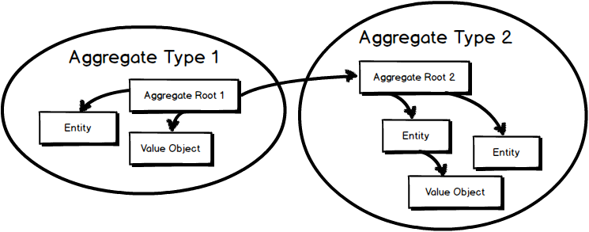

# Relationship Mapping

## Relationship Mapping

### Aggregate

> [DDD의 Aggregate](https://velog.io/@hope0206/DDD-%EB%8F%84%EB%A9%94%EC%9D%B8-%EC%A3%BC%EB%8F%84-%EC%84%A4%EA%B3%84-%EC%95%A0%EA%B7%B8%EB%A6%AC%EA%B1%B0%ED%8A%B8Aggregate-%EC%95%8C%EC%95%84%EB%B3%B4%EA%B8%B0)

<figure><figcaption>
Aggregate Conceptional Diagram (Source: <a href="https://www.google.com/url?sa=i&#x26;url=https%3A%2F%2Fmedium.com%2F%40edin.sahbaz%2Fexploring-the-power-of-aggregates-in-domain-driven-design-and-clean-architecture-6408d6128d3b&#x26;psig=AOvVaw1F5XUGZLy9PnEH8_p3A866&#x26;ust=1706943493973000&#x26;source=images&#x26;cd=vfe&#x26;opi=89978449&#x26;ved=0CBIQjRxqFwoTCICh0ZaKjIQDFQAAAAAdAAAAABAE">Medium</a>) 
</figcaption></figure>

Entity에서 관계 생성시 CascadeType.ALL, orphanRemoval=true를 함께 사용하는 것을 권장. 처음에는 이 방식으로만 사용하자

조회 성능이 중요한, 일정 규모 이상의 시스템에서는 Command, Query를 구분해서 다루는 것이 좋다

\-> Command: JPA, Relational Mapping 추천

\-> Query: JdbcTemplate 추천 (Kotlin은 Exposed)

### Event Sourcing

> [Event Sourcing Pattern](https://learn.microsoft.com/ko-kr/azure/architecture/patterns/event-sourcing)

이벤트 데이터를 삽입만 하여 데이터의 상태를 관리한다.

애플리케이션의 상태 변화를 이벤트로 저장하고, 과거의 시점으로 언제든지 돌아갈수 있는 방법

* 추가 이벤트, 수정 이벤트, 삭제 이벤트
* 이벤트는 전부 DB에 적재되며, 수정은 수정 이벤트를 추가하여 발생한다.

다음과 같은 특징을 가진다

* 불변성
* 확장성
* 재생성
* 추가 가능성

다만 애플리케이션을 재구성하기 위해 이벤트를 재생해야 하는점이 있다.&#x20;

### CQRS

> 데이터 저장소로부터의 읽기와 업데이트 작업을 분리하는 패턴
>
> [CQRS](https://learn.microsoft.com/ko-kr/azure/architecture/patterns/cqrs)

Command and Query Responsibility Segregation (명령, 조회 책임 분리)

* Command
  * 명령의 형태는 '판매 물품의 가격을 지정된 가격으로 변경한다' 가 아니라 판매 '물품 가격 변경'으로 표현한다.
  * Command는 일반적으로 큐에 적재후 비동기적으로 처리한다.
* Query
  * Query는 Database를 절대 수정하지 않는다.
  * 어떠한 캡슐화된 로직도 갖지 않는 DTO를 반환한다.
